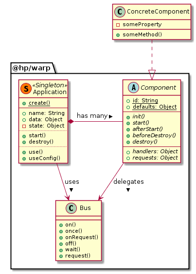

# WARP
----

### Overview


### Installation
``` bash
$ npm install @hp/warp --save
```

### Usage
```js
import warp from '@hp/warp';

let app = warp({ name: 'pretty-fucking-awesome' });
  app.start()).then(() =>
  app.bus.emit(`log`, `app started`)).catch(console.error);
```
